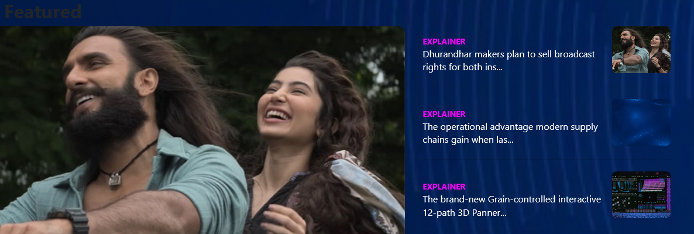
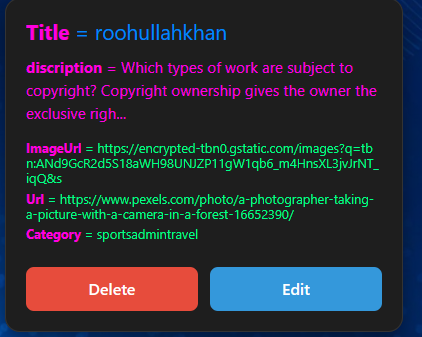
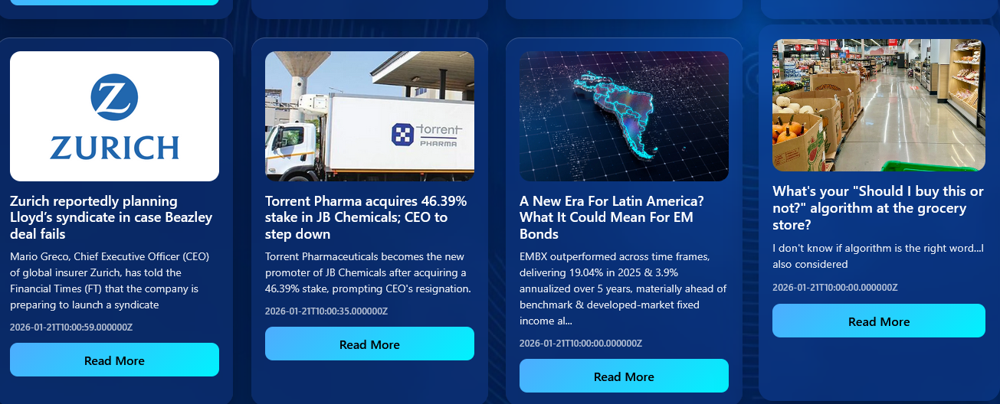
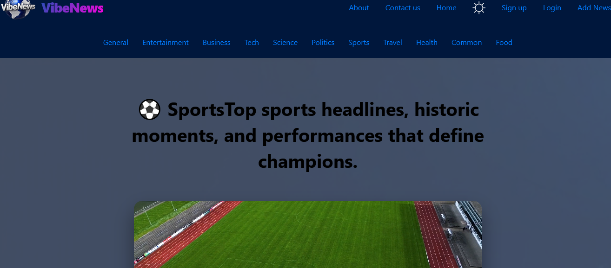
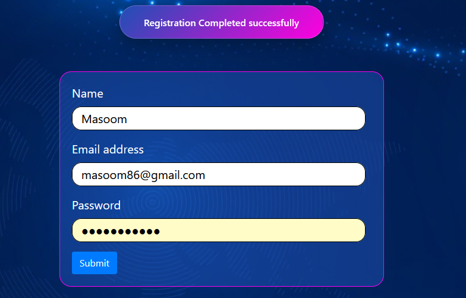

# 📰 VibeNews — Full-Stack News Portal

VibeNews is a modern **Full-Stack News Content Management System** built with the MERN stack.  
It provides real-time news updates, secure authentication, and a role-based Admin Dashboard for managing content efficiently.

---

## 🌐 Live Preview
- **Frontend:** https://your-vercel-link.vercel.app  
- **Backend API:** https://vibenews-backend-production.up.railway.app  

---

## 📸 Screenshots

### 🏠 Home Page
Main news feed with category-based filtering and responsive layout.  


---

### 🛠 Admin Dashboard
Secure admin panel to create, update, and delete news articles.  


---

### 🗂 News Categories
Organized category-wise news display for better user experience.  


---

### 🧭 Navigation System
Clean and dynamic navigation with protected routes.  


---

### 🔐 Authentication
JWT-based secure login and signup system.  


---

## 🛠️ Tech Stack

### 🎨 Frontend


---

### ⚙️ Backend


---

### 🚀 Deployment


---

## ✨ Key Features

- 🔐 **Role-Based Access Control** (Admin / User)
- 📰 **Full CRUD Operations** for news management
- ⚡ **Fast REST API** with optimized queries
- 📱 **Fully Responsive UI** (Mobile-First Design)
- 🌙 **Dark / Light Mode**
- 🔒 **Environment-secured credentials**
- 🧠 **Clean Architecture (MVC Pattern)**

---
## Environment Varaibles
MONGO_URI=your_mongodb_connection_string
---
JWT_SECRET=your_secret_key
---
PORT=8080
---
NEWS_API_KEY=your news-api-key
---
RESEND_API_KEY=your-resend-api-key
###---
## 🚀 Installation & Setup
👨‍💻 Author
Qudrat Ullah
Full-Stack MERN Developer
📍 Pakistan
GitHub: https://github.com/qudratullah-stack
LinkedIn: (add if available)
📜 License
This project is licensed for learning and portfolio purposes.

### 1️⃣ Clone Repository
```bash
git clone https://github.com/your-username/vibenews-frontend.git

---
### Install Dependencies
```bach npm install
